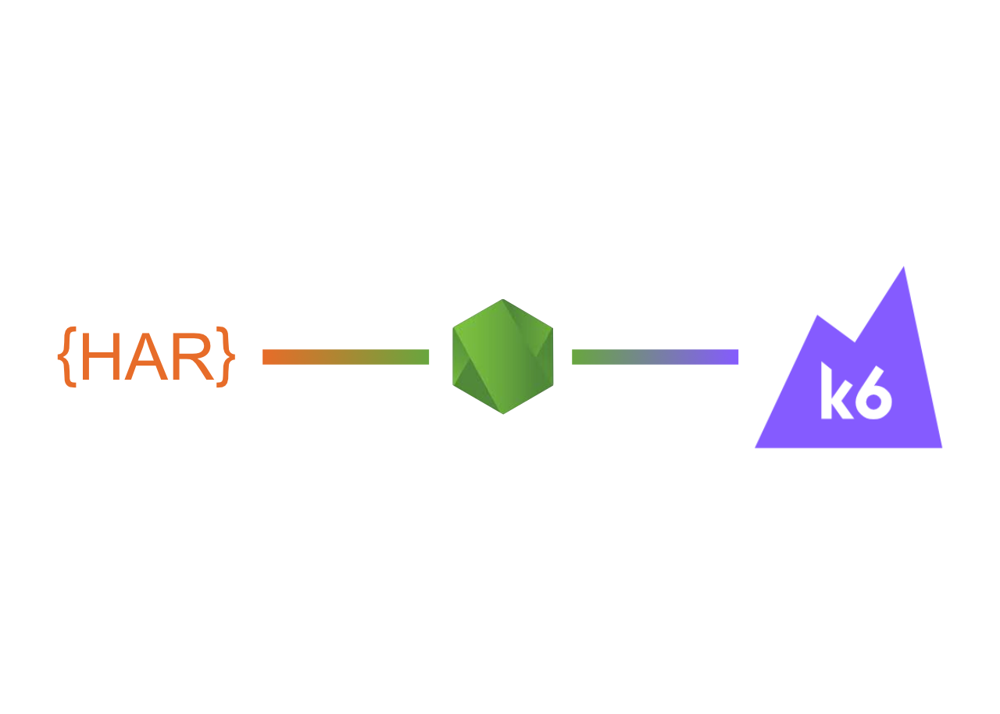

<div align="center">



# har-to-k6
Converts [LI-HAR](li-har.spec.md) and [HAR](https://w3c.github.io/web-performance/specs/HAR/Overview.html) to [K6 script](https://docs.k6.io/docs).


</div>

<br/><br/>

## Content
- [Installation](#installation)
  - [Local Installation (recommended)](#local-installation-recommended)
  - [Global Installation](#global-installation)
  - [Docker](#docker)
- [Usage](#usage)
  - [CLI Usage](#cli-usage)
  - [Programmatic Usage](#programmatic-usage)
  - [Browser Usage](#browser-usage)
- [Specifications](#specifications)
- [Credits](#credits)

## Installation

### Local Installation (recommended)

While possible to install globally, we recommend that you, if possible, add the converter to the
`node_modules` of your test project using:

```shell
$ npm install --save har-to-k6
```

Note that this will require you to run the converter with `npx har-to-k6 your-har-file` or,
if you are using an older version of npm, ``./node_modules/.bin/har-to-k6 your-har-file`.

### Global Installation

```shell
$ npm install --global har-to-k6
```

### Docker

```shell
$ docker pull loadimpact/har-to-k6:latest
```

## Usage

### CLI Usage

#### Npx
```shell
$ npx har-to-k6 archive.har -o my-k6-script.js
```

#### From `node_modules`

```shell
$ ./node_modules/.bin/har-to-k6 archive.har -o my-k6-script.js
```

#### Global

```shell
$ har-to-k6 archive.tar -o my-k6-script.js
```

### Programmatic Usage

#### Converting

```js
const fs = require("fs");
const { liHARToK6Script } = require("har-to-k6");

async function run () {
  const archive = readArchive();
  const { main } = await liHARToK6Script(archive);
  fs.writeFileSync("./load-test.js", main);
}
```

#### Validating

Use `validate()` to run validation alone. Returns without error for a valid
archive. Throws `InvalidArchiveError` for validation failure.

```js
const { InvalidArchiveError, validate } = require("har-to-k6");

const archive = readArchive();
try {
  validate(archive);
} catch (error) {
  if (error instanceof InvalidArchiveError) {
    // Handle invalid archive
  } else {
    throw error;
  }
}
```

### Browser Usage

`har-to-k6` can be ran in the browser. This exposes the standard
API under `harToK6`.


#### Importing as ES module
```javascript
import { liHARToK6Script } from "har-to-k6";
```

#### CommonJS style
```javascript
const { liHARToK6Script } = require("har-to-k6");
```

#### Using a `<script>` tag

Load `standalone.js` into your HTML page:

```html
<html>
  <head>
    <title>HAR Converter</title>
    <script src="standalone.js"></script>
    <script src="index.js"></script>
  </head>
</html>
```

#### Example

The API is available:

```js
async function run () {
    const archive = readArchive();
    harToK6.validate(archive);
    const { main } = await harToK6.liHARToK6Script(archive);
    displayResult(main);
}
```

## Specifications


- [LI-HAR](li-har.spec.md) - Static configuration format representing a
  [_K6 script_](https://docs.k6.io/docs)
- [LI-HAR to K6 converter](converter.spec.md) - JavaScript package or function
  that converts a given [_LI-HAR_](li-har.spec.md) to a
  [_K6 script_](https://docs.k6.io/docs)
- [LI-HAR to K6 CLI tool](cli-tool.spec.md) - a Node.js CLI tool exposing an
  interface for converting a given [_LI-HAR_](li-har.spec.md) to a
  [_K6 script_](https://docs.k6.io/docs)

## Credits
Thanks to [bookmoons](https://github.com/bookmoons) for creating this tool 🎉
